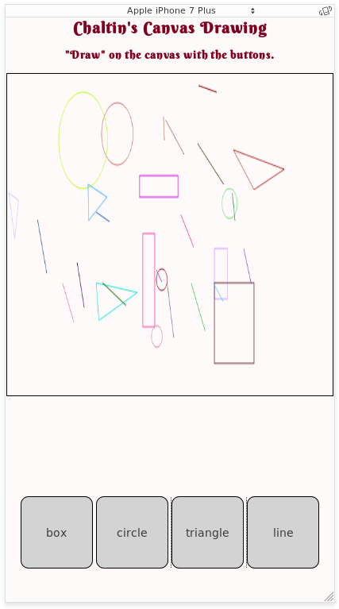

# Table of Contents

* [Thrifting in NYC](#thrift)
* [Canvas Drawing](#canvas)

## Thrifing in NYC (2017) 

Project made during [Project Code](https://sites.google.com/a/nypl.org/techconnect/project_-code-1) at the New York Public Library.

Built with HTML and CSS.

GitHub: [https://github.com/ChaltinPagan/chaltinpagan.github.io](https://github.com/ChaltinPagan/chaltinpagan.github.io)

Website: [chaltinpagan.github.io](https://chaltinpagan.github.io)

Mobile-friendly Version: [chaltinpagan.github.io/thrift](https://chaltinpagan.github.io/thrift) 

## Canvas Drawing (2017) 

Project made during Access Code at [Coalition for Queens](https://www.c4q.nyc/) (C4Q).

Built with HTML, CSS, and JS. Moderately mobile-friendly.

GitHub: [https://github.com/ChaltinPagan/chaltinpagan.github.io/tree/master/canvas-drawing](https://github.com/ChaltinPagan/chaltinpagan.github.io/tree/master/canvas-drawing)

Website: [chaltinpagan.github.io/canvas-drawing](https://chaltinpagan.github.io/canvas-drawing)

Web view:

Mobile view:

